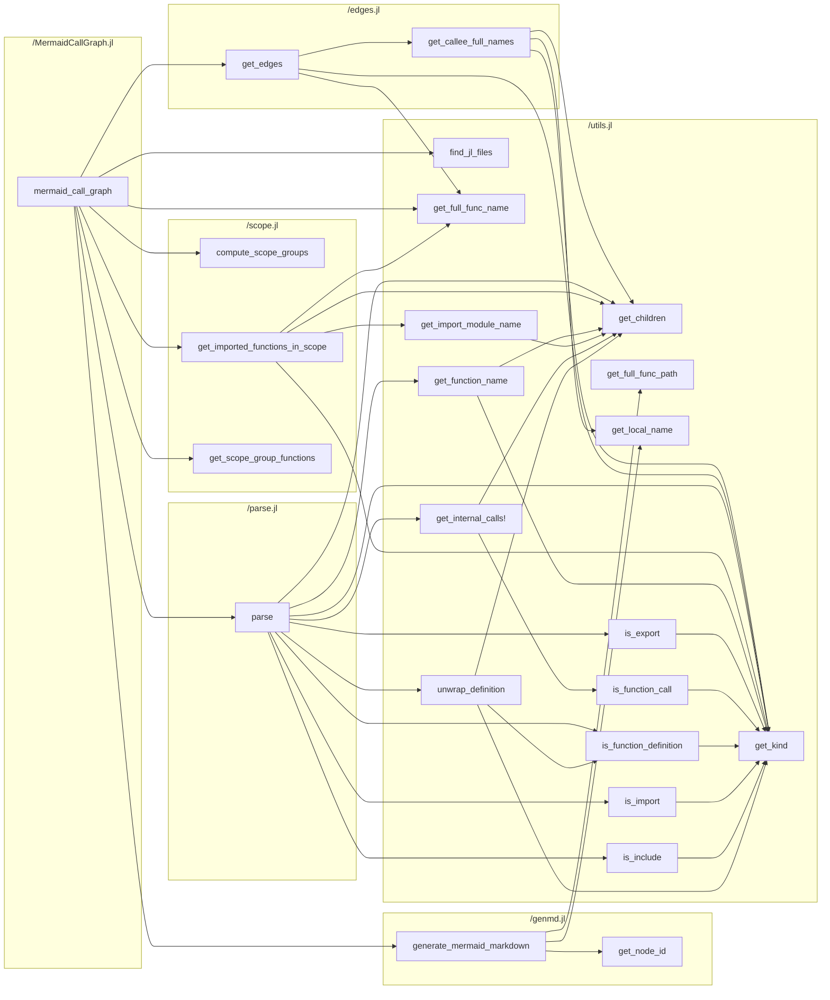

# MermaidCallGraph.jl

[](https://github.com/t-garin/MermaidCallGraph.jl/actions/workflows/CI.yml?query=branch%3Amain)

## Description

MermaidCallGraph.jl analyzes a Julia project's source code and generates a
[Mermaid](https://mermaid.js.org/) flowchart of the internal call graph: which
functions call which other functions. It creates one subgraph per source file,
grouping the functions defined in that file, and draws edges for calls between
functions of the project.




## Usage

From the project root, run:

```bash
julia --project=. -e 'using MermaidCallGraph; mermaid_call_graph()'
```

This analyzes all Julia files under `src/` and writes `MermaidCallGraph.md` in
the current directory.

### Arguments

`mermaid_call_graph` accepts three optional keyword arguments:

| Argument      | Default                 | Description                                 |
|---------------|-------------------------|---------------------------------------------|
| `input_dir`   | `"src"`                 | Directory to scan for `.jl` files           |
| `output_file` | `"MermaidCallGraph.md"` | Output markdown file                        |
| `orientation` | `"LR"`                  | Mermaid graph orientation (e.g. `LR`, `TD`) |

### Examples

```bash
julia --project=. -e 'using MermaidCallGraph; mermaid_call_graph("lib", "callgraph.md", "TD")'
```

Or using keyword arguments:

```bash
julia --project=. -e 'using MermaidCallGraph; mermaid_call_graph(input_dir="lib", output_file="graph.md", orientation="TB")'
```

## Quirks

- If multiple function methods are defined in the same file, they will be merged into one node.
- Only explicit imports have a clear arrow pointing to a function, implicit imports have a "?"-marked arrow.
- If multiple function methods are in scope at the same time, edges will be drawn towards all with a a "?"-marked arrow
- Files `include`d into the same module or script share each other's functions; an included file that defines its own module keeps its own scope.
- Recursive calls are not drawn: a function calling itself does not produce an edge.
- Nested functions are not represented, and calls inside a nested function are attributed to the enclosing function.

## Contributing

Any help, feedback, or improvement is welcome! Feel free to open an issue or
submit a pull request on [GitHub](https://github.com/t-garin/MermaidCallGraph.jl).

This is my first-ever public and registered repo, I've probably made some mistakes, don't hesitate to point them out!
