# MermaidCallGraph.jl

[](https://github.com/t-garin/MermaidCallGraph.jl/actions/workflows/CI.yml?query=branch%3Amain)

## Description

MermaidCallGraph.jl analyzes a Julia project's source code and generates a
[Mermaid](https://mermaid.js.org/) flowchart of the internal call graph: which
functions call which other functions. It creates one subgraph per source file,
grouping the functions defined in that file, and draws edges for calls between
functions of the project.

```mermaid
flowchart LR
    subgraph "/MermaidCallGraph.jl"
        _MermaidCallGraph_jl_build_mermaid_call_graph["build_mermaid_call_graph"]
        _MermaidCallGraph_jl_collect_function_info["collect_function_info"]
        _MermaidCallGraph_jl_compute_edges["compute_edges"]
        _MermaidCallGraph_jl_mermaid_call_graph["mermaid_call_graph"]
    end
    subgraph "/edges.jl"
        _edges_jl_get_callee_full_names["get_callee_full_names"]
        _edges_jl_get_edges["get_edges"]
    end
    subgraph "/genmd.jl"
        _genmd_jl_assign_node_ids["assign_node_ids"]
        _genmd_jl_generate_mermaid_markdown["generate_mermaid_markdown"]
        _genmd_jl_get_node_id["get_node_id"]
    end
    subgraph "/parse.jl"
        _parse_jl_parse["parse"]
    end
    subgraph "/scope.jl"
        _scope_jl_compute_scope_groups["compute_scope_groups"]
        _scope_jl_get_imported_functions_in_scope["get_imported_functions_in_scope"]
        _scope_jl_get_scope_group_functions["get_scope_group_functions"]
    end
    subgraph "/utils.jl"
        _utils_jl_get_callee["get_callee"]
        _utils_jl_get_children["get_children"]
        _utils_jl_get_full_func_name["get_full_func_name"]
        _utils_jl_get_full_func_path["get_full_func_path"]
        _utils_jl_get_function_name["get_function_name"]
        _utils_jl_get_internal_calls_["get_internal_calls!"]
        _utils_jl_get_kind["get_kind"]
        _utils_jl_get_local_name["get_local_name"]
        _utils_jl_unwrap["unwrap"]
    end
    _MermaidCallGraph_jl_build_mermaid_call_graph --> _MermaidCallGraph_jl_collect_function_info
    _MermaidCallGraph_jl_build_mermaid_call_graph --> _MermaidCallGraph_jl_compute_edges
    _MermaidCallGraph_jl_build_mermaid_call_graph --> _genmd_jl_generate_mermaid_markdown
    _MermaidCallGraph_jl_build_mermaid_call_graph --> _parse_jl_parse
    _MermaidCallGraph_jl_build_mermaid_call_graph --> _scope_jl_compute_scope_groups
    _MermaidCallGraph_jl_collect_function_info --> _utils_jl_get_full_func_name
    _MermaidCallGraph_jl_compute_edges --> _edges_jl_get_edges
    _MermaidCallGraph_jl_compute_edges --> _scope_jl_get_imported_functions_in_scope
    _MermaidCallGraph_jl_compute_edges --> _scope_jl_get_scope_group_functions
    _MermaidCallGraph_jl_compute_edges --> _utils_jl_get_full_func_name
    _MermaidCallGraph_jl_mermaid_call_graph --> _MermaidCallGraph_jl_build_mermaid_call_graph
    _edges_jl_get_callee_full_names --> _utils_jl_get_children
    _edges_jl_get_callee_full_names --> _utils_jl_get_full_func_name
    _edges_jl_get_callee_full_names --> _utils_jl_get_kind
    _edges_jl_get_callee_full_names --> _utils_jl_get_local_name
    _edges_jl_get_edges --> _edges_jl_get_callee_full_names
    _edges_jl_get_edges --> _utils_jl_get_full_func_name
    _genmd_jl_assign_node_ids --> _genmd_jl_get_node_id
    _genmd_jl_generate_mermaid_markdown --> _genmd_jl_assign_node_ids
    _genmd_jl_generate_mermaid_markdown --> _utils_jl_get_full_func_path
    _genmd_jl_generate_mermaid_markdown --> _utils_jl_get_local_name
    _parse_jl_parse --> _utils_jl_get_children
    _parse_jl_parse --> _utils_jl_get_function_name
    _parse_jl_parse --> _utils_jl_get_internal_calls_
    _parse_jl_parse --> _utils_jl_get_kind
    _parse_jl_parse --> _utils_jl_unwrap
    _scope_jl_get_imported_functions_in_scope --> _utils_jl_get_children
    _scope_jl_get_imported_functions_in_scope --> _utils_jl_get_full_func_name
    _scope_jl_get_imported_functions_in_scope --> _utils_jl_get_kind
    _utils_jl_get_callee --> _utils_jl_get_children
    _utils_jl_get_function_name --> _utils_jl_get_children
    _utils_jl_get_function_name --> _utils_jl_get_kind
    _utils_jl_get_internal_calls_ --> _utils_jl_get_callee
    _utils_jl_get_internal_calls_ --> _utils_jl_get_children
    _utils_jl_get_internal_calls_ --> _utils_jl_get_kind
    _utils_jl_unwrap --> _utils_jl_get_children
    _utils_jl_unwrap --> _utils_jl_get_kind
```


## Usage

From the project root, run:

```bash
julia --project=. -e 'using MermaidCallGraph; mermaid_call_graph()'
```

This analyzes all Julia files under `src/` and writes `MermaidCallGraph.md` in
the current directory.

### Arguments

`mermaid_call_graph` accepts three optional keyword arguments:

| Argument      | Default                 | Description                                 |
|---------------|-------------------------|---------------------------------------------|
| `input_dir`   | `"src"`                 | Directory to scan for `.jl` files           |
| `output_file` | `"MermaidCallGraph.md"` | Output markdown file                        |
| `orientation` | `"LR"`                  | Mermaid graph orientation (e.g. `LR`, `TD`) |

### Examples

```bash
julia --project=. -e 'using MermaidCallGraph; mermaid_call_graph("lib", "callgraph.md", "TD")'
```

Or using keyword arguments:

```bash
julia --project=. -e 'using MermaidCallGraph; mermaid_call_graph(input_dir="lib", output_file="graph.md", orientation="TB")'
```

## Quirks

These quirks are not set in stone, feel free to submit a PR or issue if you want some behaviour fixed.

- If multiple function methods are defined in the same file, they will be merged into one node.
- A "?"-marked arrow means the call is ambiguous: several same-named functions are in scope, so an edge is drawn to each of them.
- A clear arrow means the callee is uniquely resolved (single same-scope definition, explicit import, or qualified call).
- Files `include`d into the same module or script share each other's functions; an included file that defines its own module keeps its own scope.
- Recursive calls are not drawn: a function calling itself does not produce an edge.
- Nested functions are not represented, and calls inside a nested function are attributed to the enclosing function.
- Struct and abstract-type definitions are not represented as nodes; a plain constructor call (`Point(...)`) draws no edge.
- A callable struct (`(f::Point)(k)`) registers the type name as a function, so any `Point(...)` call — including default-constructor calls — draws an edge to that method (resolution is name-based, dispatch is not modeled); the constructor call inside the method itself is treated as self-recursion and not drawn.
- Files that fail to parse are skipped with a warning instead of aborting the whole analysis.
- Only string-literal `include`s are resolved: `include("a.jl")`, `Base.include("a.jl")`, and the module-qualified forms `include(mod, "a.jl")` / `Base.include(mod, "a.jl")`; any other form (`include()`, `include(joinpath(...))`, interpolated strings) is ignored with a warning.
- Chained comparisons (`a < b < c`, `a == b == c`) are not recognized as calls, so no edge is drawn even if the project defines the operator.
- Only the first top-level `module` in a file is analyzed; code after it (including other `module` blocks) is ignored, and functions inside nested modules are not analyzed.
- Duplicate module names across files collide: only the last one parsed is remembered, so imports of the other may resolve to nothing or to the wrong file.
- Code inside quoted expressions (`:(...)`, e.g. in `@eval` or generated-function bodies) is treated as executed, which can draw edges for calls that never run.
- Inner constructors (`struct Box; Box(x) = ...; end`) are not represented, and constructor calls draw no edge.

## Contributing

Any help, feedback, or improvement is welcome! Feel free to open an issue or
submit a pull request on [GitHub](https://github.com/t-garin/MermaidCallGraph.jl).

This is my first-ever public and registered repo, I've probably made some mistakes, don't hesitate to point them out!
