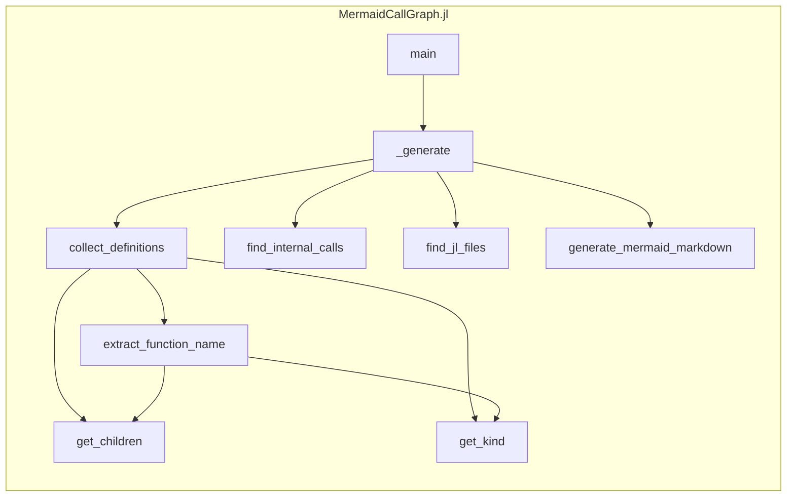

```mermaid
flowchart LR
    subgraph MermaidCallGraph.jl
        _generate["_generate"]
        collect_definitions["collect_definitions"]
        extract_function_name["extract_function_name"]
        find_internal_calls["find_internal_calls"]
        find_jl_files["find_jl_files"]
        generate_mermaid_markdown["generate_mermaid_markdown"]
        get_children["get_children"]
        get_kind["get_kind"]
        main["main"]
    end
    _generate --> collect_definitions
    _generate --> find_internal_calls
    _generate --> find_jl_files
    _generate --> generate_mermaid_markdown
    collect_definitions --> extract_function_name
    collect_definitions --> get_children
    collect_definitions --> get_kind
    extract_function_name --> get_children
    extract_function_name --> get_kind
    main --> _generate
```
