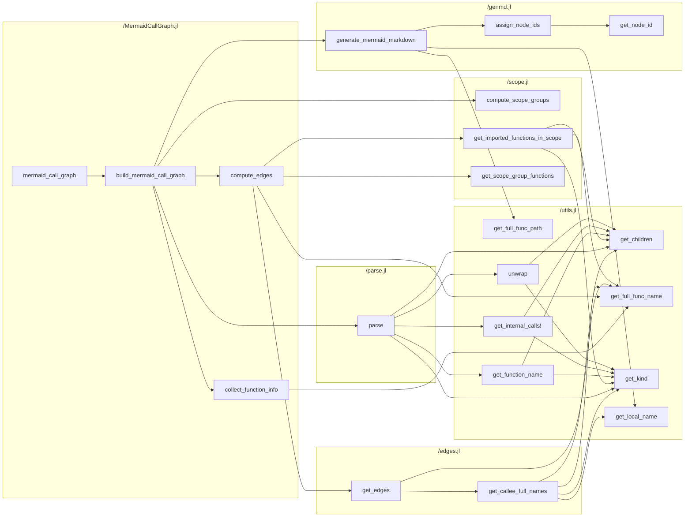

```mermaid
flowchart LR
    subgraph "/MermaidCallGraph.jl"
        _MermaidCallGraph_jl_build_mermaid_call_graph["build_mermaid_call_graph"]
        _MermaidCallGraph_jl_collect_function_info["collect_function_info"]
        _MermaidCallGraph_jl_compute_edges["compute_edges"]
        _MermaidCallGraph_jl_mermaid_call_graph["mermaid_call_graph"]
    end
    subgraph "/edges.jl"
        _edges_jl_get_callee_full_names["get_callee_full_names"]
        _edges_jl_get_edges["get_edges"]
    end
    subgraph "/genmd.jl"
        _genmd_jl_assign_node_ids["assign_node_ids"]
        _genmd_jl_generate_mermaid_markdown["generate_mermaid_markdown"]
        _genmd_jl_get_node_id["get_node_id"]
    end
    subgraph "/parse.jl"
        _parse_jl_parse["parse"]
    end
    subgraph "/scope.jl"
        _scope_jl_compute_scope_groups["compute_scope_groups"]
        _scope_jl_get_imported_functions_in_scope["get_imported_functions_in_scope"]
        _scope_jl_get_scope_group_functions["get_scope_group_functions"]
    end
    subgraph "/utils.jl"
        _utils_jl_get_children["get_children"]
        _utils_jl_get_full_func_name["get_full_func_name"]
        _utils_jl_get_full_func_path["get_full_func_path"]
        _utils_jl_get_function_name["get_function_name"]
        _utils_jl_get_internal_calls_["get_internal_calls!"]
        _utils_jl_get_kind["get_kind"]
        _utils_jl_get_local_name["get_local_name"]
        _utils_jl_unwrap["unwrap"]
    end
    _MermaidCallGraph_jl_build_mermaid_call_graph --> _MermaidCallGraph_jl_collect_function_info
    _MermaidCallGraph_jl_build_mermaid_call_graph --> _MermaidCallGraph_jl_compute_edges
    _MermaidCallGraph_jl_build_mermaid_call_graph --> _genmd_jl_generate_mermaid_markdown
    _MermaidCallGraph_jl_build_mermaid_call_graph --> _parse_jl_parse
    _MermaidCallGraph_jl_build_mermaid_call_graph --> _scope_jl_compute_scope_groups
    _MermaidCallGraph_jl_collect_function_info --> _utils_jl_get_full_func_name
    _MermaidCallGraph_jl_compute_edges --> _edges_jl_get_edges
    _MermaidCallGraph_jl_compute_edges --> _scope_jl_get_imported_functions_in_scope
    _MermaidCallGraph_jl_compute_edges --> _scope_jl_get_scope_group_functions
    _MermaidCallGraph_jl_compute_edges --> _utils_jl_get_full_func_name
    _MermaidCallGraph_jl_mermaid_call_graph --> _MermaidCallGraph_jl_build_mermaid_call_graph
    _edges_jl_get_callee_full_names --> _utils_jl_get_children
    _edges_jl_get_callee_full_names --> _utils_jl_get_full_func_name
    _edges_jl_get_callee_full_names --> _utils_jl_get_kind
    _edges_jl_get_callee_full_names --> _utils_jl_get_local_name
    _edges_jl_get_edges --> _edges_jl_get_callee_full_names
    _edges_jl_get_edges --> _utils_jl_get_full_func_name
    _genmd_jl_assign_node_ids --> _genmd_jl_get_node_id
    _genmd_jl_generate_mermaid_markdown --> _genmd_jl_assign_node_ids
    _genmd_jl_generate_mermaid_markdown --> _utils_jl_get_full_func_path
    _genmd_jl_generate_mermaid_markdown --> _utils_jl_get_local_name
    _parse_jl_parse --> _utils_jl_get_children
    _parse_jl_parse --> _utils_jl_get_function_name
    _parse_jl_parse --> _utils_jl_get_internal_calls_
    _parse_jl_parse --> _utils_jl_get_kind
    _parse_jl_parse --> _utils_jl_unwrap
    _scope_jl_get_imported_functions_in_scope --> _utils_jl_get_children
    _scope_jl_get_imported_functions_in_scope --> _utils_jl_get_full_func_name
    _scope_jl_get_imported_functions_in_scope --> _utils_jl_get_kind
    _utils_jl_get_function_name --> _utils_jl_get_children
    _utils_jl_get_function_name --> _utils_jl_get_kind
    _utils_jl_get_internal_calls_ --> _utils_jl_get_children
    _utils_jl_get_internal_calls_ --> _utils_jl_get_kind
    _utils_jl_unwrap --> _utils_jl_get_children
    _utils_jl_unwrap --> _utils_jl_get_kind
```
