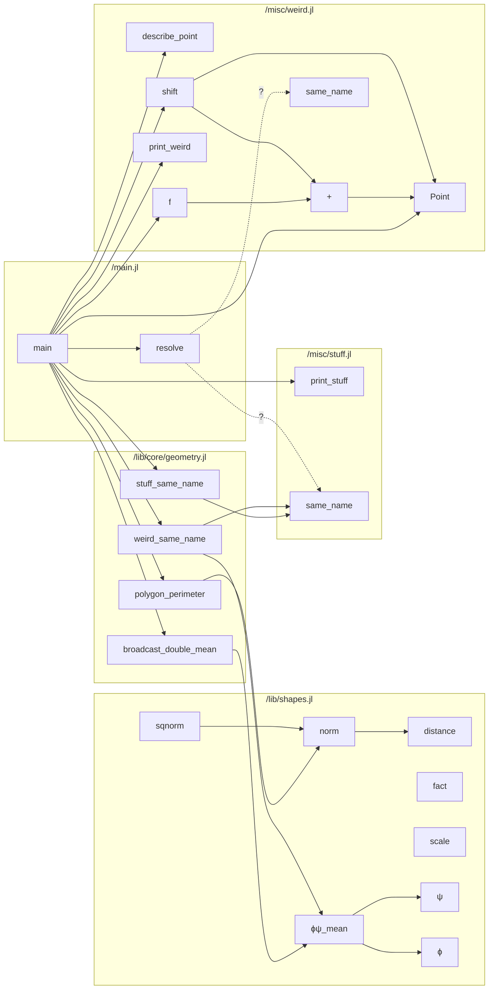

```mermaid
flowchart LR
    subgraph "/lib/core/geometry.jl"
        _lib_core_geometry_jl_broadcast_double_mean["broadcast_double_mean"]
        _lib_core_geometry_jl_polygon_perimeter["polygon_perimeter"]
        _lib_core_geometry_jl_stuff_same_name["stuff_same_name"]
        _lib_core_geometry_jl_weird_same_name["weird_same_name"]
    end
    subgraph "/lib/shapes.jl"
        _lib_shapes_jl_distance["distance"]
        _lib_shapes_jl_fact["fact"]
        _lib_shapes_jl_norm["norm"]
        _lib_shapes_jl_scale["scale"]
        _lib_shapes_jl_sqnorm["sqnorm"]
        _lib_shapes_jl_u3c8["ψ"]
        _lib_shapes_jl_u3d5["ϕ"]
        _lib_shapes_jl_u3d5u3c8_mean["ϕψ_mean"]
    end
    subgraph "/main.jl"
        _main_jl_main["main"]
        _main_jl_resolve["resolve"]
    end
    subgraph "/misc/stuff.jl"
        _misc_stuff_jl_print_stuff["print_stuff"]
        _misc_stuff_jl_same_name["same_name"]
    end
    subgraph "/misc/weird.jl"
        _misc_weird_jl__["+"]
        _misc_weird_jl_Point["Point"]
        _misc_weird_jl_describe_point["describe_point"]
        _misc_weird_jl_f["f"]
        _misc_weird_jl_print_weird["print_weird"]
        _misc_weird_jl_same_name["same_name"]
        _misc_weird_jl_shift["shift"]
    end
    _lib_core_geometry_jl_broadcast_double_mean --> _lib_shapes_jl_u3d5u3c8_mean
    _lib_core_geometry_jl_polygon_perimeter --> _lib_shapes_jl_norm
    _lib_core_geometry_jl_stuff_same_name --> _misc_stuff_jl_same_name
    _lib_core_geometry_jl_weird_same_name --> _lib_shapes_jl_u3d5u3c8_mean
    _lib_core_geometry_jl_weird_same_name --> _misc_stuff_jl_same_name
    _lib_shapes_jl_norm --> _lib_shapes_jl_distance
    _lib_shapes_jl_sqnorm --> _lib_shapes_jl_norm
    _lib_shapes_jl_u3d5u3c8_mean --> _lib_shapes_jl_u3c8
    _lib_shapes_jl_u3d5u3c8_mean --> _lib_shapes_jl_u3d5
    _main_jl_main --> _lib_core_geometry_jl_broadcast_double_mean
    _main_jl_main --> _lib_core_geometry_jl_polygon_perimeter
    _main_jl_main --> _lib_core_geometry_jl_stuff_same_name
    _main_jl_main --> _lib_core_geometry_jl_weird_same_name
    _main_jl_main --> _main_jl_resolve
    _main_jl_main --> _misc_stuff_jl_print_stuff
    _main_jl_main --> _misc_weird_jl_Point
    _main_jl_main --> _misc_weird_jl_describe_point
    _main_jl_main --> _misc_weird_jl_f
    _main_jl_main --> _misc_weird_jl_print_weird
    _main_jl_main --> _misc_weird_jl_shift
    _main_jl_resolve -. ? .-> _misc_stuff_jl_same_name
    _main_jl_resolve -. ? .-> _misc_weird_jl_same_name
    _misc_weird_jl__ --> _misc_weird_jl_Point
    _misc_weird_jl_f --> _misc_weird_jl__
    _misc_weird_jl_shift --> _misc_weird_jl__
    _misc_weird_jl_shift --> _misc_weird_jl_Point
```
