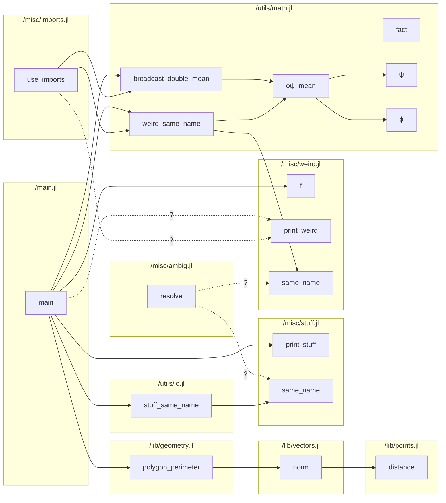

```mermaid
flowchart LR
    subgraph "/lib/geometry.jl"
        _lib_geometry_jl_polygon_perimeter["polygon_perimeter"]
    end
    subgraph "/lib/points.jl"
        _lib_points_jl_distance["distance"]
    end
    subgraph "/lib/vectors.jl"
        _lib_vectors_jl_norm["norm"]
    end
    subgraph "/main.jl"
        _main_jl_main["main"]
    end
    subgraph "/misc/ambig.jl"
        _misc_ambig_jl_resolve["resolve"]
    end
    subgraph "/misc/imports.jl"
        _misc_imports_jl_use_imports["use_imports"]
    end
    subgraph "/misc/stuff.jl"
        _misc_stuff_jl_print_stuff["print_stuff"]
        _misc_stuff_jl_same_name["same_name"]
    end
    subgraph "/misc/weird.jl"
        _misc_weird_jl_f["f"]
        _misc_weird_jl_print_weird["print_weird"]
        _misc_weird_jl_same_name["same_name"]
    end
    subgraph "/utils/io.jl"
        _utils_io_jl_stuff_same_name["stuff_same_name"]
    end
    subgraph "/utils/math.jl"
        _utils_math_jl_broadcast_double_mean["broadcast_double_mean"]
        _utils_math_jl_fact["fact"]
        _utils_math_jl_weird_same_name["weird_same_name"]
        _utils_math_jl_u3c8["ψ"]
        _utils_math_jl_u3d5["ϕ"]
        _utils_math_jl_u3d5u3c8_mean["ϕψ_mean"]
    end
    _lib_geometry_jl_polygon_perimeter --> _lib_vectors_jl_norm
    _lib_vectors_jl_norm --> _lib_points_jl_distance
    _main_jl_main --> _lib_geometry_jl_polygon_perimeter
    _main_jl_main --> _misc_stuff_jl_print_stuff
    _main_jl_main --> _misc_weird_jl_f
    _main_jl_main -. ? .-> _misc_weird_jl_print_weird
    _main_jl_main --> _utils_io_jl_stuff_same_name
    _main_jl_main --> _utils_math_jl_broadcast_double_mean
    _main_jl_main --> _utils_math_jl_weird_same_name
    _misc_ambig_jl_resolve -. ? .-> _misc_stuff_jl_same_name
    _misc_ambig_jl_resolve -. ? .-> _misc_weird_jl_same_name
    _misc_imports_jl_use_imports -. ? .-> _misc_weird_jl_print_weird
    _misc_imports_jl_use_imports --> _utils_math_jl_broadcast_double_mean
    _misc_imports_jl_use_imports --> _utils_math_jl_weird_same_name
    _utils_io_jl_stuff_same_name --> _misc_stuff_jl_same_name
    _utils_math_jl_broadcast_double_mean --> _utils_math_jl_u3d5u3c8_mean
    _utils_math_jl_weird_same_name --> _misc_weird_jl_same_name
    _utils_math_jl_weird_same_name --> _utils_math_jl_u3d5u3c8_mean
    _utils_math_jl_u3d5u3c8_mean --> _utils_math_jl_u3c8
    _utils_math_jl_u3d5u3c8_mean --> _utils_math_jl_u3d5
```
