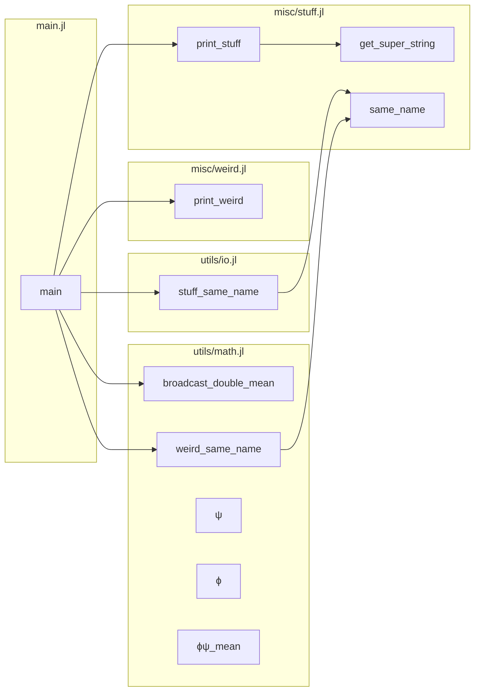

```mermaid
flowchart LR
    subgraph main.jl
        main["main"]
    end
    subgraph misc/stuff.jl
        get_super_string["get_super_string"]
        print_stuff["print_stuff"]
        same_name["same_name"]
    end
    subgraph misc/weird.jl
        print_weird["print_weird"]
        same_name["same_name"]
    end
    subgraph utils/io.jl
        stuff_same_name["stuff_same_name"]
    end
    subgraph utils/math.jl
        broadcast_double_mean["broadcast_double_mean"]
        weird_same_name["weird_same_name"]
        ψ["ψ"]
        ϕ["ϕ"]
        ϕψ_mean["ϕψ_mean"]
    end
    main --> broadcast_double_mean
    main --> print_stuff
    main --> print_weird
    main --> stuff_same_name
    main --> weird_same_name
    print_stuff --> get_super_string
    stuff_same_name --> same_name
    weird_same_name --> same_name
```
